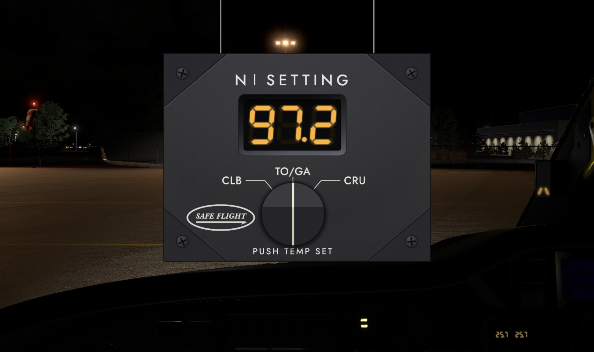

# Safe Flight N1 Computer

An X-Plane 12 recreation of the Safe Flight N1 Computer/Display (P/N C-12732-1),
the three-digit amber panel instrument that tells a Citation 525 crew what fan
speed to set. It reads ram air temperature and pressure altitude, looks up the
flight manual's thrust schedule, and drives a popup faceplate. The FAA-approved
supplement covering the installation — Cessna Model 525, Section V, Supplement 6
— calls it the _SafeFlight N1 Reminder_, and its behaviour is what this models.

The plugin activates only while the TorqueSim CitationJet 525 is the user
aircraft.



## Downloading

**Not a developer?** Grab the latest release from the
[Releases page](https://github.com/RISCfuture/c525-n1-computer/releases), unzip
it, and put the `SafeFlightN1` folder inside the `Resources/plugins` folder of
your X-Plane 12 installation. Once installed, the plugin can keep itself up to
date through
[SkunkCrafts Updater](https://forums.x-plane.org/index.php?/forums/forum/311-skunkcrafts-updater/).

Want to read the manual first? It ships inside the download, and it is also
available on its own at
[SafeFlightN1-Manual.pdf](https://github.com/RISCfuture/c525-n1-computer/releases/latest/download/SafeFlightN1-Manual.pdf),
which always resolves to the current one.

## Requirements

- X-Plane 12.3.0 or newer (built against X-Plane SDK 4.3.0, XPLM420)
- The TorqueSim CitationJet 525
- macOS 12+, Windows 10+, or Linux

## Building

The X-Plane SDK is vendored under `SDK/`, so no download step is needed. Any
generator CMake supports will do — Xcode, Visual Studio, Ninja, Make:

```sh
cmake -S . -B build -DCMAKE_BUILD_TYPE=Release
cmake --build build --config Release --parallel
```

CMake writes the `.xpl` to the per-platform folder X-Plane expects —
`mac_x64`, `win_x64` or `lin_x64` — and copies `data/` and `assets/` beside it,
so `dist/SafeFlightN1` is a complete, installable plugin folder.

`scripts/build.sh` wraps those two commands for macOS and Linux.

macOS builds are universal (arm64 + x86_64). Pass
`-DCMAKE_OSX_ARCHITECTURES=arm64` for a single-arch configure, which is also
what clang-tidy needs to read the compile database.

### Installing a development build

Point `XPLANE_DIR` at your X-Plane 12 installation. There is no default: X-Plane
lives wherever you put it, and that differs on every platform and every machine.

```sh
XPLANE_DIR="/path/to/X-Plane 12" scripts/install-dev.sh
```

That symlinks `dist/SafeFlightN1` into `Resources/plugins`, so a rebuild is
picked up on the next sim start without copying anything. On Windows, use a
directory junction from an elevated PowerShell:

```powershell
New-Item -ItemType Junction `
  -Path "C:\X-Plane 12\Resources\plugins\SafeFlightN1" `
  -Target "$PWD\dist\SafeFlightN1"
```

Copying `dist\SafeFlightN1` into `Resources\plugins` works everywhere too; it
just has to be redone after each build.

## Testing

```sh
tests/run_tests.sh                # host tests: table lookup and device logic, no sim
```

The interpolation and state-machine logic is pure C++ with no XPLM dependency,
so it compiles and runs directly. The suite uses
[doctest](https://github.com/doctest/doctest), so arguments go to the runner:
`tests/run_tests.sh --list-test-cases`, or `tests/run_tests.sh -tc="*anti-ice*"`
to run one case. `tests/sim/` holds a FlyWithLua harness that
exercises the plugin inside X-Plane against an independent Lua reimplementation
of the table lookup; see its README.

## Linting

CI runs these on every push, and they are all installable from Homebrew or apt:

```sh
clang-format --dry-run -Werror src/*.cpp src/*.h tests/test_main.cpp
clang-tidy -p <build-dir> src/*.cpp
cppcheck --enable=unusedFunction --inline-suppr --std=c++20 -I src -I SDK/CHeaders/XPLM src/
ruff check scripts/ && ruff format --check scripts/
shellcheck scripts/*.sh tests/run_tests.sh
```

## Vendored dependencies

`lib/` and `SDK/` are committed in source form, so a clone builds offline with
no setup step and an old tag still reproduces the binary that shipped with it.
They are not stale by accident — the versions are pinned in
`scripts/update-vendor.sh`:

```sh
scripts/update-vendor.sh --check   # does the tree still match its pins?
scripts/update-vendor.sh           # refresh, then review the diff and commit
```

`lib/ImgWindow` is excluded on purpose: it is a heavily modified derivative
rather than a tracked copy. [`lib/README.md`](lib/README.md) explains why.

## Layout

| Path | What's in it |
| --- | --- |
| `src/` | The plugin. `n1_tables` and `n1_computer` are pure logic; everything else touches XPLM. |
| `lib/` | Vendored Dear ImGui, ImgWindow, stb_image and doctest. See `lib/README.md`. |
| `SDK/` | The X-Plane SDK, vendored so CI can link. |
| `data/` | N1 schedule tables as CSV. See `data/PROVENANCE.md`. |
| `assets/` | Faceplate and knob art, authored as SVG. |
| `docs/` | `CONTRACTS.md` is the reference for interfaces and behaviour; `manual/` is the user manual. |
| `scripts/` | Build, install, vendored-dependency updates, screenshot capture and manual rendering. |
| `tests/` | Host tests and the in-sim Lua harness. |
| `fastlane/` | macOS code signing via _match_. |

[`CHANGELOG.md`](CHANGELOG.md) records what changed between releases.

Start with [`docs/CONTRACTS.md`](docs/CONTRACTS.md): it fixes the CSV schema,
the module APIs, the published datarefs and commands, and the modelled display
and failure behaviour, quoting the flight manual supplement it comes from.

## Credits

The N1 schedules this plugin reads are not its author's work. They were
transcribed from the _TorqueSim Cessna Citation 525 Performance Manual_, a
community-built chart set — **not** a TorqueSim, X-Aviation or Textron document
— by **hornetaircraft**, assisted by **Aviationsocal**, **Kaboom**,
**Jetpipeoverheat** and **Cptlee**, and published free on the [X-Pilot
forums](https://forums.x-pilot.com/files/file/1613-torquesim-cessna-citation-525-performance-manual/).

Every cell was cross-checked against **Matchstick's** [CJ525 N1
Calculator](https://forums.x-pilot.com/files/file/1635-cj525-n1-calculator/),
the FlyWithLua script that first brought these schedules into X-Plane.

Without their charts there would be nothing for this instrument to display.
[`data/PROVENANCE.md`](data/PROVENANCE.md) records the transcription cell by
cell, including where the source pages contradict themselves.

Those tables have since been checked against Cessna's own Model 525 Operating
Manual thrust-setting graphs, which agree to within about half a percent N1 and
back every cell where this repo departed from a printed community value. That
manual and the flight manual supplement were both lent privately and are not
redistributable, so they are not in this repository;
`scripts/digitize_om_charts.py` reproduces the comparison from your own copy.

## Licence

The plugin source is MIT licensed — see [`LICENSE`](LICENSE).

**`data/` is not.** The N1 schedules carry the terms in
[`data/LICENSE.md`](data/LICENSE.md): they are redistributed here only so the
plugin works, and the credit for them belongs upstream.

Vendored third-party code keeps its own terms: Dear ImGui, stb_image and
doctest are MIT, ImgWindow is BSD-3-Clause, the X-Plane SDK is BSD-style
(`SDK/license.txt`), and the Jost typeface is under the SIL Open Font License
(`assets/fonts/OFL.txt`). [`lib/README.md`](lib/README.md) records every
vendored version, its upstream, and the one place we patch one.

Not affiliated with, endorsed by, or supported by Safe Flight Instrument, LLC,
Textron Aviation, or TorqueSim. Advisory simulation only — not for real world
use.
